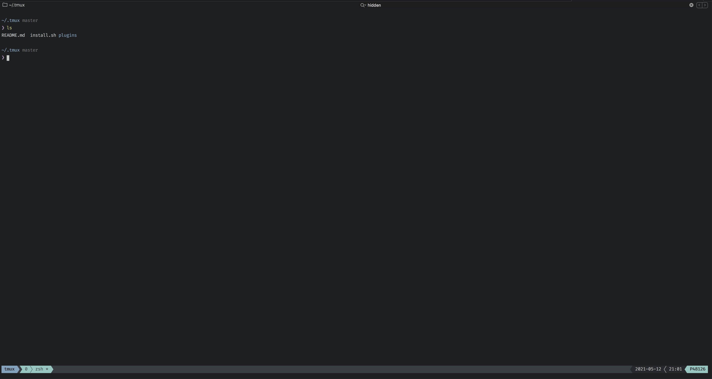

# My Tmux config
I made it into quite an easy to learn setup. Hope this can also help those who wants to start using Tmux with some advanced features.


## One Command Install
```sh
bash <(curl -s https://raw.githubusercontent.com/daiyanze/my-tmux-config/master/install.sh)
```

## Installed Plugins
I've installed some cool looking plugins to extend the functionalities.

- [Tmux Plugin Manager](https://github.com/tmux-plugins/tpm) You know what it is...
- [Tmux sensible](https://github.com/tmux-plugins/tmux-sensible) Basic Tmux settings everyone can agree on
- [Tmux pain control](https://github.com/tmux-plugins/tmux-pain-control) standard pane key-bindings for tmux
- [Tmux sessionist](https://github.com/tmux-plugins/tmux-sessionist) Persists tmux environment across system restarts.
- [Tmux resurrect](https://github.com/tmux-plugins/tmux-resurrect) Lightweight tmux utils for manipulating sessions

## Key Bindings
(TODO)

## License
MIT
